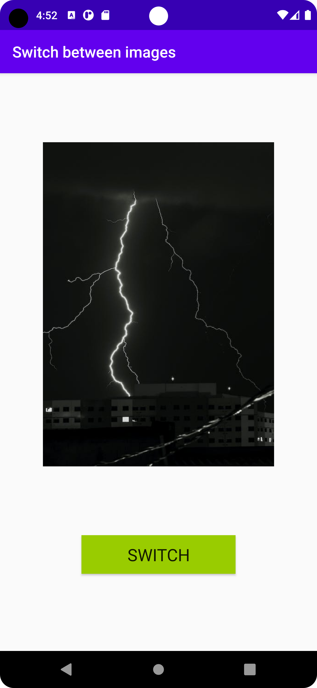
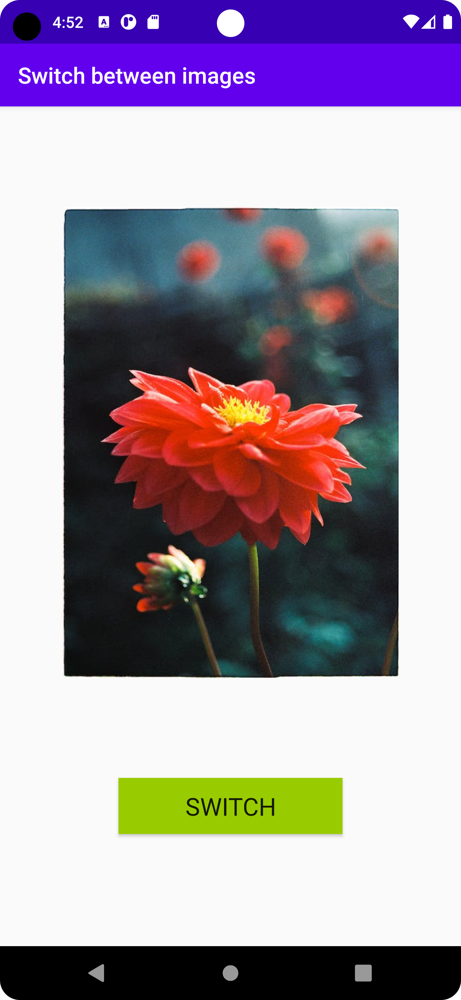

# Rapport

First I implemented the Picasso library by adding the following code inside build.gradle(Module:app).

```
implementation 'com.squareup.picasso:picasso:2.71828'
```

There is an ImageView and a button in the layout, which is connected to MainActivity through
findViewById(). Two urls to no-copyright images are stored within strings, which can be loaded
into the ImageView using Picasso. The button is used to switch between the two images, which is done
using a boolean value together with an if- and else-statement. At startup the image from url1 is displayed
The function fit() is called through Picasso to make the loaded image fit properly within the constraints of the ImageView.


```
img = findViewById(R.id.imageView);
Picasso.get().load(url1).fit().into(img);
btn = findViewById(R.id.button);
btn.setOnClickListener(new View.OnClickListener() {
    @Override
    public void onClick(View view) {
        if (switchImg) {
            Picasso.get().load(url1).fit().into(img);
            switchImg = false;
        }
        else {
            Picasso.get().load(url2).fit().into(img);
            switchImg = true;
        }

    }
});
        

```



